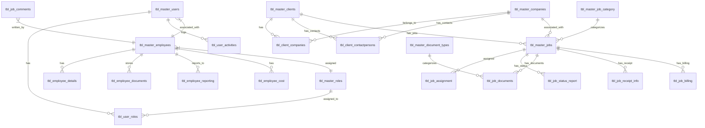

# Workflow Management Database Architecture

## Database Schema Overview

This document provides a comprehensive overview of the WM2 (Workflow Management) database architecture, displaying the relationships between tables and their key attributes.

## Tables and Relationships

## Table Descriptions

### Master Tables

1. **tbl_master_users**
   - Primary identifier for system users
   - Contains authentication information and employee association
   - Key fields: user_id, user_name, email_id, user_password, user_role, employee_id

2. **tbl_master_employees**
   - Stores employee information
   - Contains personal and professional details
   - Key fields: employee_id, org_employee_id, employee_name, date_of_joining, role_id

3. **tbl_master_roles**
   - Defines roles in the system
   - Key fields: role_id, role_name, role_description, role_type

4. **tbl_master_clients**
   - Contains client information
   - Key fields: client_id, client_name, client_status

5. **tbl_master_companies**
   - Stores company details
   - Key fields: company_id, company_name, company_tax_identifier_value

6. **tbl_master_jobs**
   - Central table for job management
   - Contains job details, dates, and associations
   - Key fields: job_id, job_name, job_status, client_id, company_id

7. **tbl_master_job_category**
   - Categorizes jobs
   - Key fields: job_category_id, job_description

8. **tbl_master_document_types**
   - Defines types of documents in the system
   - Key fields: document_id, document_type, document_category

### Relationship and Detail Tables

1. **tbl_user_activities**
   - Logs user activities in the system
   - Key fields: activity_id, activity_name, created_by

2. **tbl_user_roles**
   - Maps users to roles
   - Key fields: user_role_id, user_id, role_id

3. **tbl_employee_details & tbl_employee_documents**
   - Store employee-related documents and details
   - Key fields: employee_id, document references

4. **tbl_employee_reporting**
   - Defines reporting hierarchy
   - Key fields: employee_id, manager_id

5. **tbl_employee_cost**
   - Stores employee cost/billing information
   - Key fields: employee_id, cost_per_hour, billing_per_hour

6. **tbl_client_companies**
   - Maps clients to companies
   - Key fields: client_id, company_id

7. **tbl_client_contactpersons**
   - Stores contact information for clients
   - Key fields: contactperson_id, client_id, company_id

8. **tbl_job_assignment**
   - Associates jobs with employees
   - Key fields: job_id, assignee_employee_id

9. **tbl_job_status_report**
   - Stores job status updates
   - Key fields: job_id, assignee_employee_id, status_description

10. **tbl_job_comments**
    - Stores comments on jobs
    - Key fields: job_comment_id, commenter_id

11. **tbl_job_documents**
    - Associates documents with jobs
    - Key fields: job_document_id, job_id, document_type_id

12. **tbl_job_receipt_info**
    - Stores receipt information for jobs
    - Key fields: job_receipt_id, job_id

13. **tbl_job_billing**
    - Stores billing information for jobs
    - Key fields: job_billing_id, job_id, client_id

## Key Database Relationships

1. Users are associated with employees and have roles
2. Employees have roles, reporting relationships, and cost information
3. Clients are associated with companies and have contact persons
4. Jobs belong to clients and companies
5. Jobs have assignments, status reports, documents, receipts, and billing information

## Database Design Notes

- The database uses SQLite with foreign key constraints enabled
- Integer primary keys are used throughout
- Various date fields track the lifecycle of entities
- Status fields allow workflow state tracking
